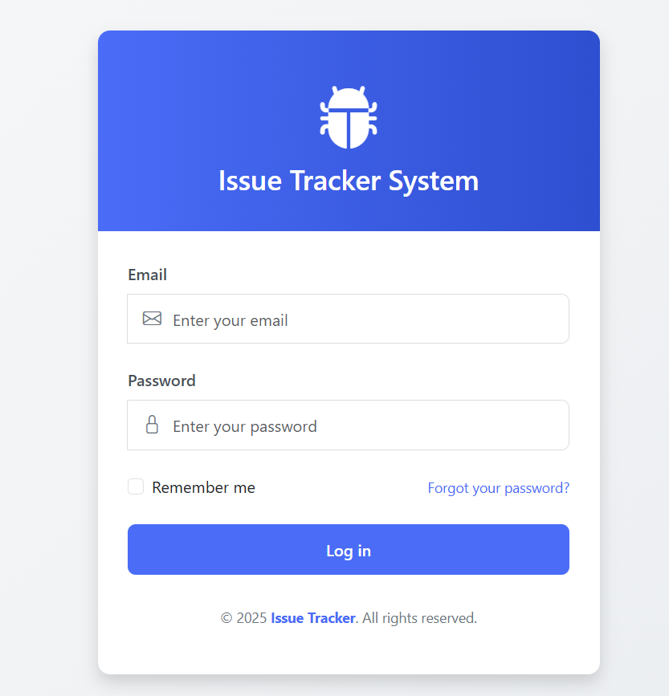
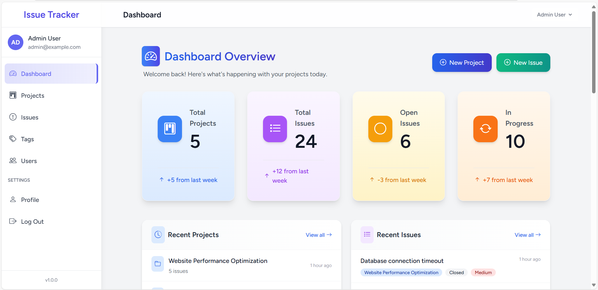
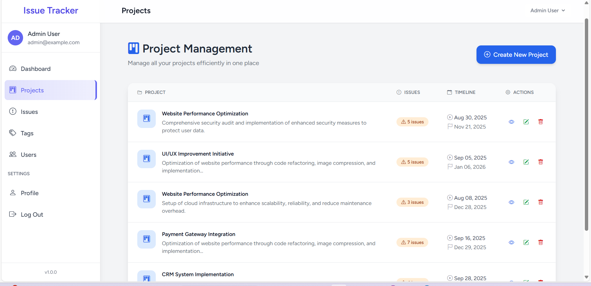
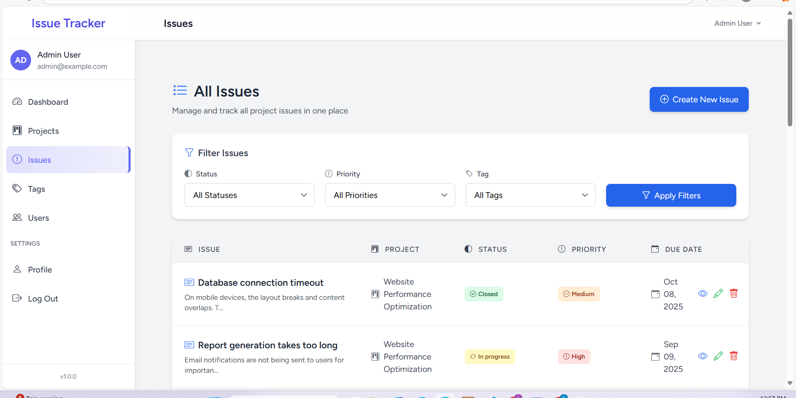
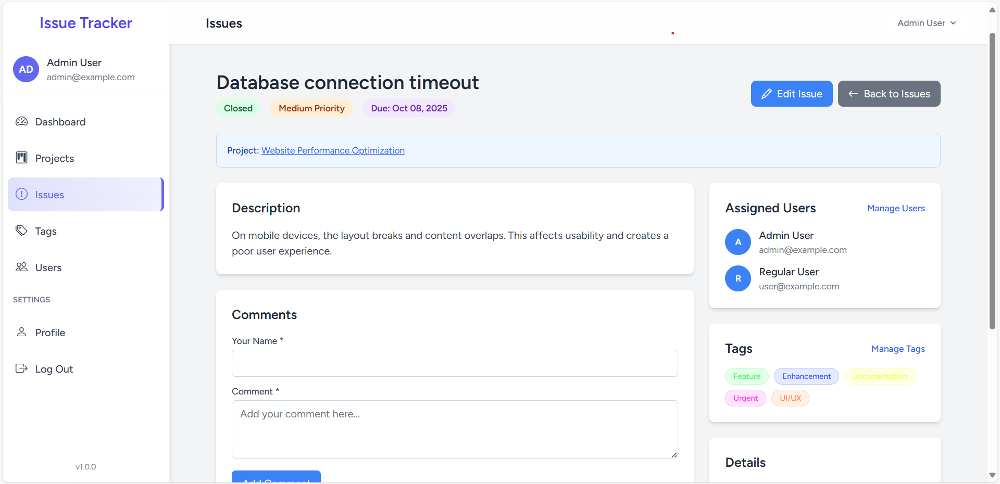

# 📝 Mini Issue Tracker

A Laravel-based Issue Tracking System for small teams to manage projects, issues, tags, and comments efficiently.  

---

## 🚀 Quick Start

### Requirements
- PHP 8.1+
- Composer
- MySQL/MariaDB
- Node.js & NPM

### Installation

1. **Clone the repository**
   git clone https://github.com/ElsaImeri/-mini-issue-tracker-project.git
   Note: The folder name may start with a dash (-mini-issue-tracker-project).
  In that case, either rename the folder manually to mini-issue-tracker-project,
 or use quotes when changing directory:

 cd ".\-mini-issue-tracker-project"

 Install dependencies

composer install
npm install && npm run build

Configure environment

cp .env.example .env
php artisan key:generate

 
Update .env with your database credentials:

DB_DATABASE=your_database
DB_USERNAME=your_username
DB_PASSWORD=your_password

Create the database manually (via phpMyAdmin or MySQL console):

CREATE DATABASE mini_issue_tracker_project 

Initialize database

php artisan migrate:fresh --seed

Start development server

php artisan serve

Visit 👉 http://localhost:8000

🔐 Default Login Credentials

Admin: admin@example.com / password

User: user@example.com / password

📌 Notes

🔒 Authorization policies:

Only the project owner can update or delete a project. Non-owners attempting these actions will see:

This action is unauthorized.

On the Users page, only Admins can add, edit, or delete users.
Regular users can only view the list of users (names only, no CRUD options).

✅ Database tables:

Only the tables required for the task and the users table are used.

All other default Laravel tables remain in the project but are not used.

📂 Demo data:

The system includes sample projects, issues, and tags for testing.

You can modify or delete this data as needed for your own projects.

## 📸 Screenshots

### Login Page

### Dashboard

### Project Page

### Issue Page

### Example Image

